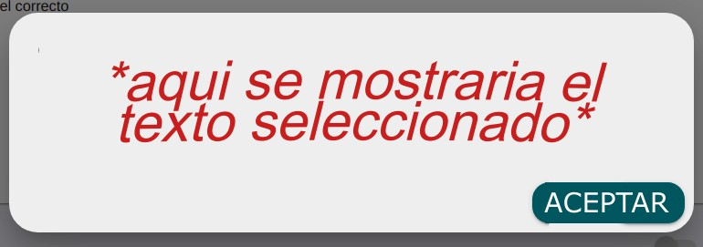

```sh
SOBRE EL PROYECTO
```

En este proyecto se fue pedido un visualizador de pdf, con capacidad de seleccionar texto del mismo, y una funcionalidad que permitiese "resaltar" o "enmarcar"
el texto seleccionado (faltante). Se utilizo una instancia de un plugin de react llamado pdf viewer, que incluye casi todo lo pedido, y permite mostrar pdfs con la 
misma facilidad con la cual uno mostraria imagenes. Aca dejo la documentacion del mismo : [react.pdf](https://www.npmjs.com/package/react-pdf).
Por falta de tiempo, la funcionalidad de "traer" el texto no fue incluida, pero se podria solucionar de la siguiente manera:

- Utilizando, por ejemplo, un dialogo customizable (custom dialog) que solo es invocado cuando la prop del outline OnItemClick es invocada. Obtendria de ahi, que es 
lo que ha sido seleccionado, y lo mostraria en este dialogo que apareceria como una especie de "zoom" en la pantalla, con un boton que diria "aceptar" cuya
funcionalidad seria la de cerrar el dialogo, y volver al viewer. Adjunto imagen de la idea



